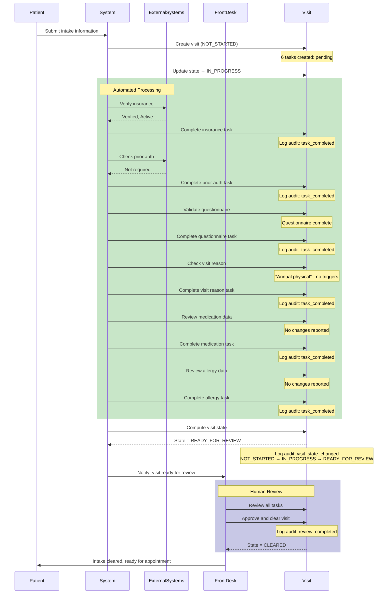
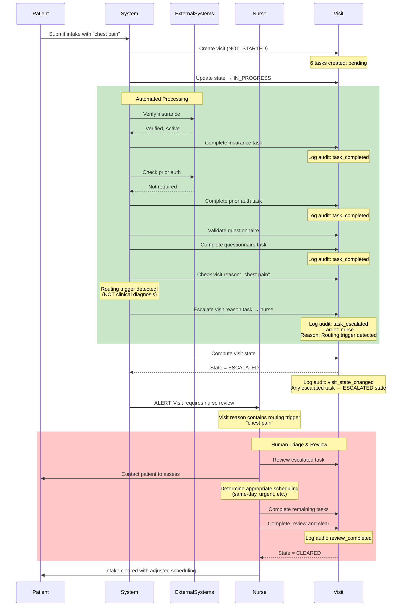
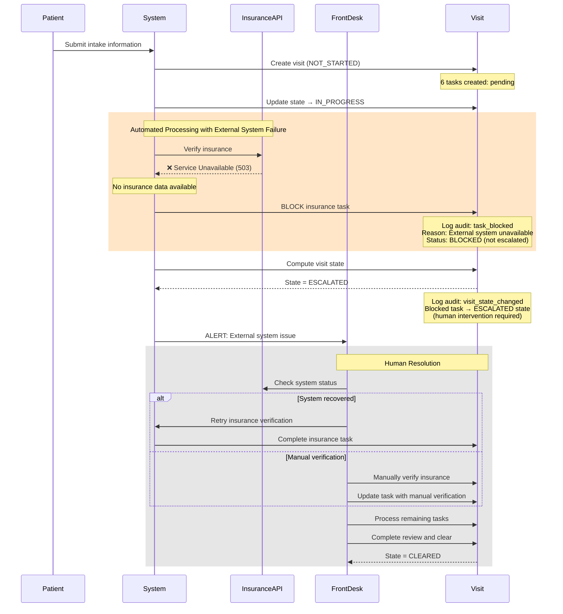

# Intake Orchestration Sequence Diagrams

## Happy Path: Successful Intake Flow

## Escalation Path: Routing Trigger Detected

## Blocked Path: Missing External Data

## State Transition Legend

- **NOT_STARTED**: Visit created, no tasks processed yet
- **IN_PROGRESS**: At least one task is pending (being processed)
- **READY_FOR_REVIEW**: All tasks completed, no escalations/blocks, awaiting human approval
- **ESCALATED**: One or more tasks escalated or blocked, requires human intervention
- **CLEARED**: Human review completed, visit ready for appointment

## Key Principles

1. **READY_FOR_REVIEW ≠ CLEARED**: Automated processing can reach READY_FOR_REVIEW, but only human review can set CLEARED
2. **BLOCKED ≠ ESCALATED semantics**: BLOCKED means external dependency unavailable; ESCALATED means data requires human review
3. **Both BLOCKED and ESCALATED**: Result in visit state = ESCALATED (human intervention needed)
4. **Routing triggers are NOT clinical**: Visit reason escalation uses keyword matching for administrative routing only
5. **Audit trail**: Every state transition and task change is logged with timestamp and details
